id: spring-native-workshop
author: Master Concept
summary: Spring Native Workshop - 學習如何建置和部署 Spring Native 應用程式到 Google Cloud Run
categories: spring,java,native,cloud,maven,graalvm
environments: Web
status: Draft
feedback link: https://github.com/mcgcrtt/KubeSummit-2025-by-iThome

# Spring Native Workshop - Image Analysis Application

## 概述 & 架構說明
Duration: 0:02:00

在本實驗中，您將實作如何：
- 建置 JIT 和 Native 的 Spring Boot 應用程式
- 比較兩種版本在映像檔大小、啟動時間和系統資源使用上的差異
- 將應用程式部署到 Google Cloud Run
- 整合 Google Cloud Vision API、Cloud Storage 和 Firestore
- 使用 Eventarc 建立事件驅動架構

### 架構圖

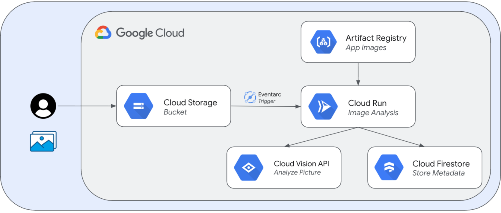

應用程式流程：
1. 使用者上傳圖片到 Cloud Storage
2. Cloud Storage 觸發 Eventarc 事件
3. Eventarc 呼叫 Cloud Run 服務
4. Cloud Run 服務使用 Vision API 分析圖片
5. 分析結果儲存到 Firestore

---

## 前置準備
Duration: 0:08:00

### 1. Google Cloud Project 設定

在開始之前，您需要：
1. 擁有一個 Google Cloud 專案
2. 啟用計費功能
3. 具備專案的 Owner 或 Editor 權限

### 2. 建立 Compute Engine VM

建立一台 VM 來執行本 Workshop 的建置工作：

**建議規格**：
- **地區**：asia-east1 (台灣)
- **區域**：any
- **作業系統**：Ubuntu 24.04 LTS x86/64
- **機器類型**：e2-standard-4 (4 vCPUs, 16 GB Memory)
- **開機磁碟大小**：100 GB (Balanced persistent disk)

**透過 Console 建立 VM**：

1. 前往 [Compute Engine > VM 執行個體](https://console.cloud.google.com/compute/instances)
2. 點擊「建立執行個體」
3. 設定以下參數：
   - **名稱**：`spring-native-workshop-vm`（或您喜歡的名稱）
   - **地區**：`asia-east1 (台灣)`
   - **區域**：`any`
   - **機器類型**：`e2-standard-4` (4 vCPUs, 16 GB Memory)
   - **開機磁碟**：
     - 作業系統：Ubuntu
     - 版本：Ubuntu 24.04 LTS x86/64
     - 大小：100 GB
4. 其他皆使用預設值
5. 點擊「建立」


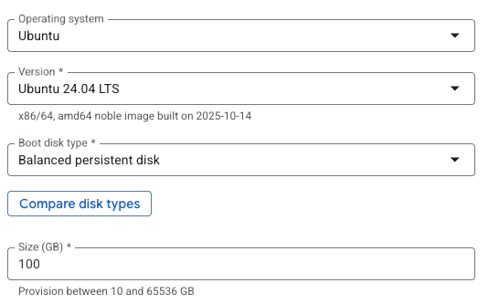

**連線到 VM**：

- 點擊 `ssh`，接著就可以看到連線畫面操作 VM，如下圖：

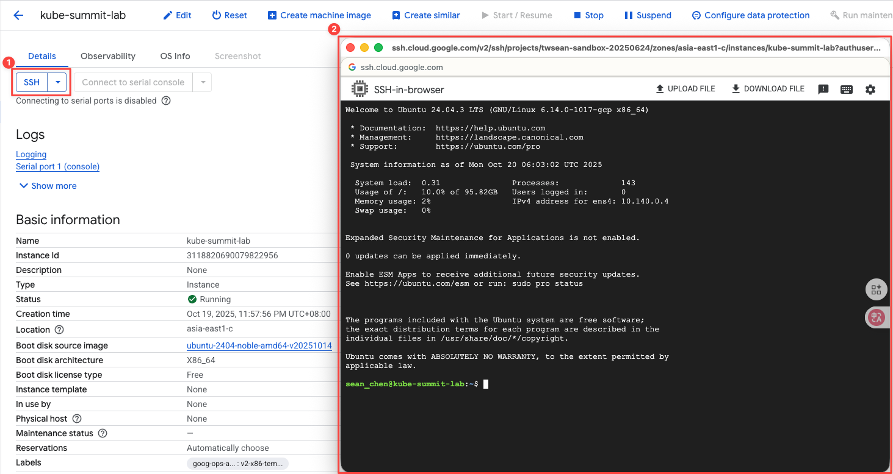

> **注意**：Native Image 編譯需要較多記憶體，建議至少使用 16 GB 記憶體的機器類型。

### 3. 環境設定

連線到 VM 後，安裝以下工具（可使用 `Lab/env/setup.sh` 腳本自動安裝）：
- Docker
- build-essential (gcc, g++, make)
- SDKMAN
- GraalVM Java 17
- Maven

**快速安裝**：

```bash
# Clone workshop repository (如果您的專案在 GitHub)
git clone https://github.com/mcgcrtt/KubeSummit-2025-by-iThome.git
cd spring-native-workshop/Lab

# 執行安裝腳本
chmod +x ./env/setup.sh
./env/setup.sh
```

或手動安裝每個工具（請參考 `Lab/env/setup.sh` 腳本內容）。

### 4. 驗證 Java 環境

確認使用的是 GraalVM 而非 OpenJDK：

```bash
# 載入 SDKMAN 環境
. $HOME/.sdkman/bin/sdkman-init.sh

# 檢查當前 Java 版本
sdk current java

# 驗證 JAVA_HOME
echo $JAVA_HOME
```

---

## Google Cloud 認證設定
Duration: 0:02:00

### 1. 登入 Google Cloud

```bash
# 登入 Google Cloud
gcloud auth login

# 設定應用程式預設憑證 (ADC)
gcloud auth application-default login
```

### 2. 設定專案環境變數

```bash
# 設定專案 ID
export PROJECT_ID=$(gcloud config get-value project)
export PROJECT_NUMBER=$(gcloud projects describe $PROJECT_ID --format='value(projectNumber)')

# 設定 gcloud 預設值
gcloud config set project ${PROJECT_ID}
gcloud config set run/platform managed
gcloud config set eventarc/location asia-east1
```

### 3. 啟用所需的 Google Cloud API

```bash
# 啟用 Vision API (圖片分析)、Cloud Functions API、Cloud Build API、Cloud Run API、Artifact Registry API、Eventarc API、Pub/Sub API (Eventarc 需要)
gcloud services enable \
    vision.googleapis.com \
    cloudfunctions.googleapis.com \
    cloudbuild.googleapis.com \
    run.googleapis.com \
    artifactregistry.googleapis.com \
    eventarc.googleapis.com \
    pubsub.googleapis.com
```

### 4. 建立 Artifact Registry Repository

- 使用 `gcloud CLI` 或者從 `GCP Console` 建立：

```bash
# 建立 JIT 版本的 Docker Repository
gcloud artifacts repositories create jit-image-docker-repo \
  --repository-format=docker \
  --location=asia-east1 \
  --description="JIT version Docker images"
```

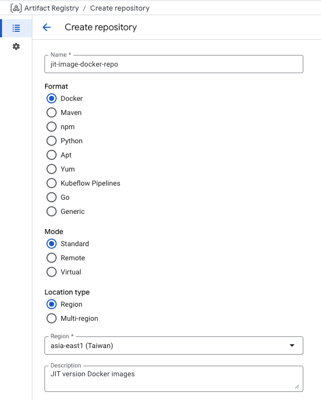

```bash
# 建立 Native 版本的 Docker Repository
gcloud artifacts repositories create native-image-docker-repo \
  --repository-format=docker \
  --location=asia-east1 \
  --description="Native version Docker images"
```

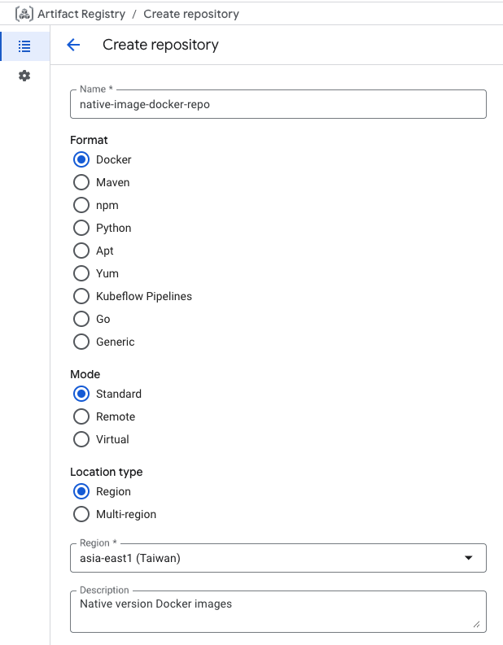

---

## 建立 Google Cloud Storage
Duration: 0:02:00

### 1. 建立 Storage Bucket

- 使用 `gcloud CLI` 或者從 `GCP Console` 建立，用於儲存上傳圖片的 GCS Bucket：

```bash
# 設定 Bucket 名稱
export BUCKET_PICTURES=uploaded-pictures-${PROJECT_ID}

# 建立 Bucket (位於歐洲區域)
gsutil mb -l asia-east1 gs://${BUCKET_PICTURES}

# 啟用統一的 Bucket 層級存取控制
gsutil uniformbucketlevelaccess set on gs://${BUCKET_PICTURES}

# 設定公開讀取權限
gsutil iam ch allUsers:objectViewer gs://${BUCKET_PICTURES}
```

### 2. 設定 Storage 服務帳戶權限

為了讓 Cloud Storage 能夠發送 Pub/Sub 事件，需要授予服務帳戶 `pubsub.publisher` 權限：

```bash
# 取得 Cloud Storage 服務帳戶
SERVICE_ACCOUNT="$(gsutil kms serviceaccount -p ${PROJECT_ID})"

# 授予 pubsub.publisher 角色
gcloud projects add-iam-policy-binding ${PROJECT_ID} \
    --member="serviceAccount:${SERVICE_ACCOUNT}" \
    --role='roles/pubsub.publisher'
```

---

## 建立 Firestore 資料庫
Duration: 0:02:00

### 1. 透過 Console 建立 Firestore

1. 前往 [Google Cloud Console - Firestore](https://console.cloud.google.com/firestore)
2. 點擊「建立資料庫」
3. 選擇 **Standard Edition**
4. 選擇 **Firestore Native**
5. 選擇區域（建議選擇靠近 GCS Bucket 所在區域，前面是選擇亞洲，因此這邊選擇：`asia-east1`）
6. 點擊「建立」

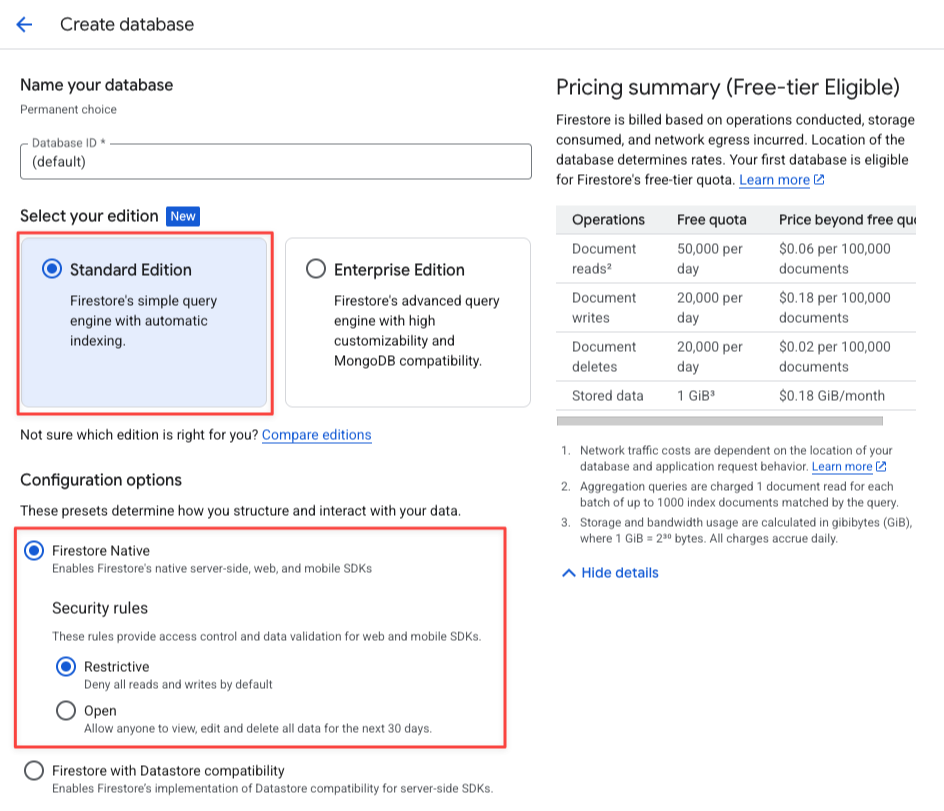
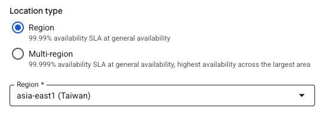

### 2. 建立 Collection

在 Firestore Console 中：
1. 點擊「Start Collection」
2. Collection ID 輸入：`pictures`
3. 新增一個測試文件（建立完成會由應用程式自動寫入）
4. 將測試文件刪除

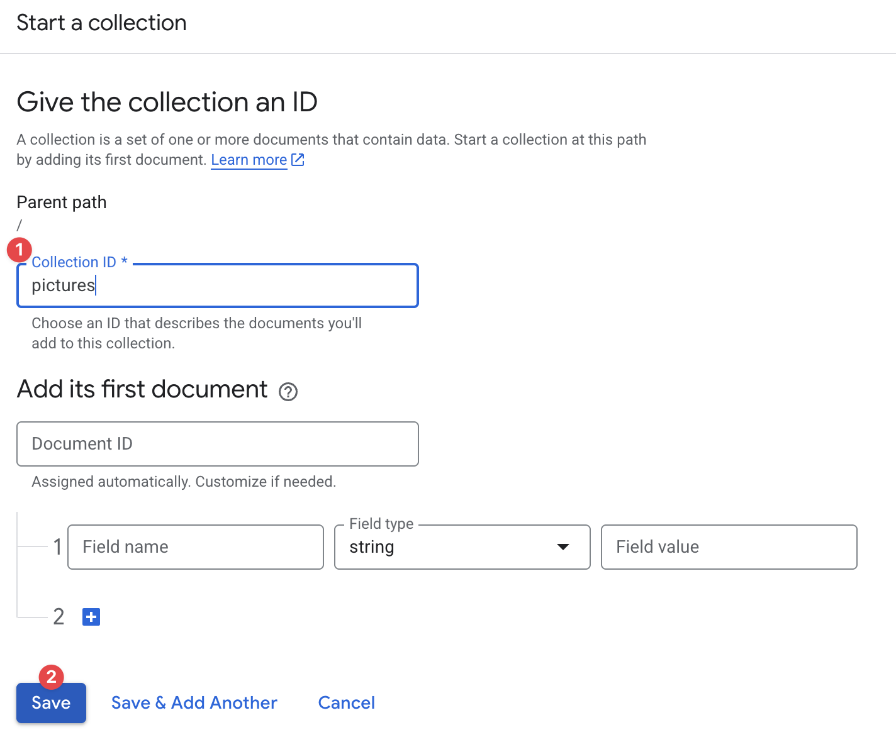
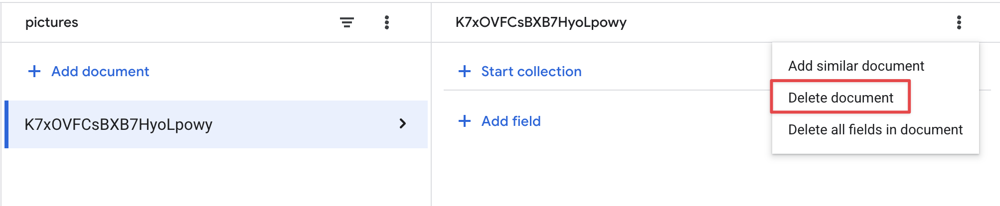

### 3. 建立複合索引

```bash
# 建立用於查詢的複合索引
gcloud firestore indexes composite create \
  --collection-group=pictures \
  --field-config field-path=thumbnail,order=descending \
  --field-config field-path=created,order=descending
```

> **注意**：索引建立可能需要數分鐘時間。

---

## 本地建置與測試 (JIT 版本)
Duration: 0:10:00

### 1. 建置 & 本地執行 JIT 應用程式

```bash
# 使用 Maven Wrapper 建置專案
./mvnw package -Pjit
```

建置完成後，會在 `target/` 目錄下產生 JAR 檔案：`image-analysis-0.0.1.jar`

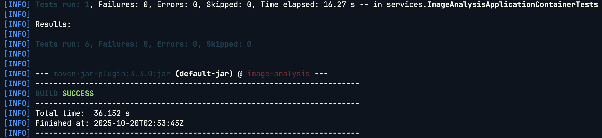

```bash
# 啟動應用程式
java -jar ./target/image-analysis-0.0.1.jar
```

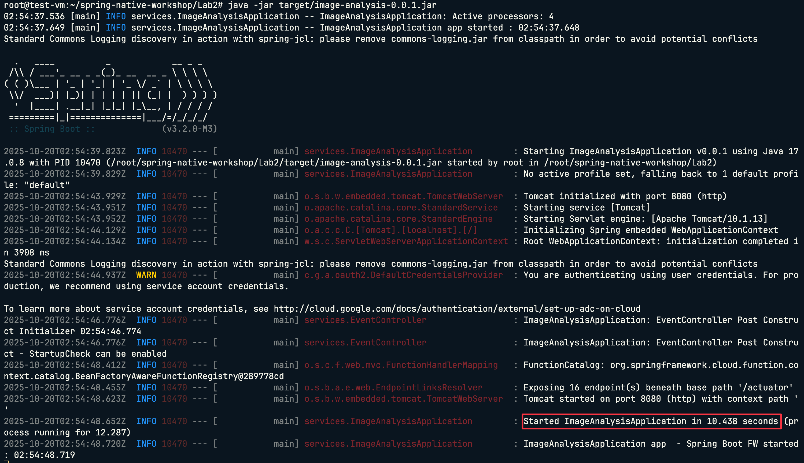

### 2. 建置 & Docker 執行 JIT Docker 映像檔

```bash
# 使用 jit profile 建置 Docker 映像檔
./mvnw spring-boot:build-image -Pjit
```

這個指令會：
- 使用 Cloud Native Buildpacks
- 建立最佳化的分層映像檔
- 映像檔名稱：`image-analysis-maven-jit`

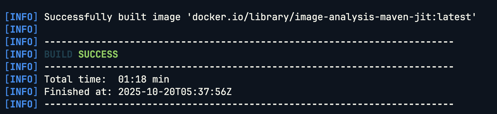

```bash
# 啟動應用程式
docker run --rm image-analysis-maven-jit:latest 
```

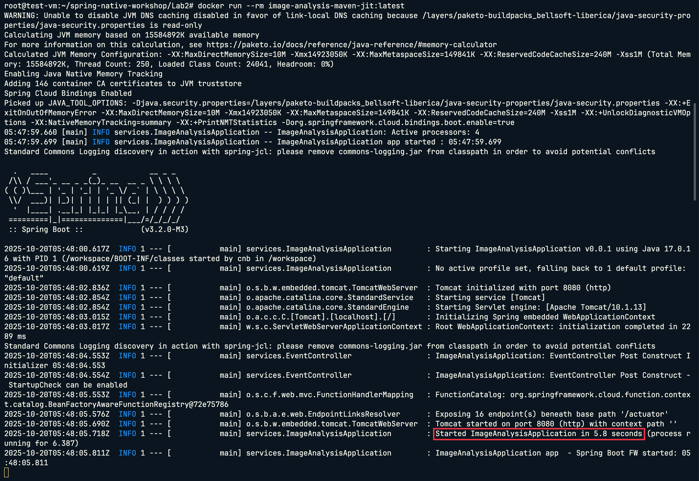

---

## 本地建置與測試 (Native 版本)
Duration: 0:25:00

### 1. 建置 & 本地執行 Native 執行檔

```bash
# 使用 native profile 建置原生執行檔
./mvnw native:compile -Pnative
```

> **重要**：Native 編譯需要較長時間，請耐心等待。

建置完成後，會在 `target/` 目錄下產生原生執行檔：`image-analysis`


```bash
# 執行原生執行檔
./target/image-analysis
```

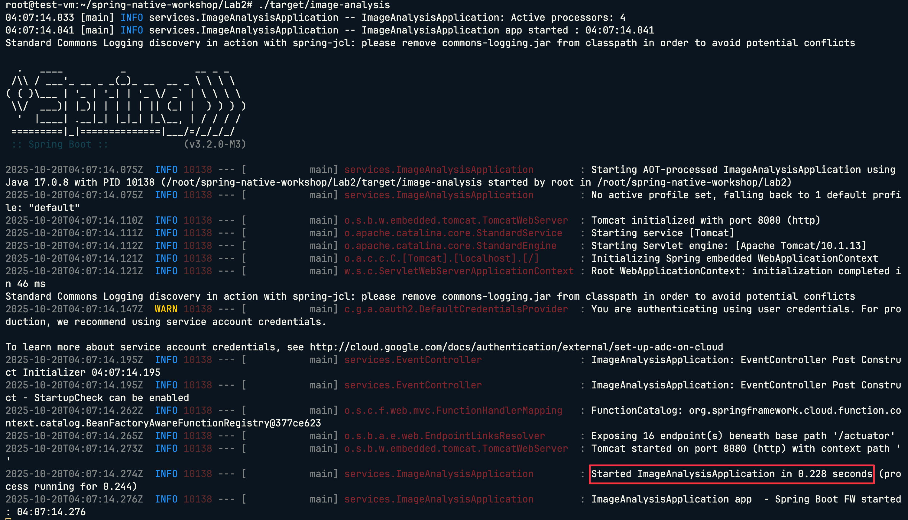

### 2. 建置 & Docker 執行 Native Docker 映像檔

```bash
# 使用 native profile 建置 Docker 映像檔
./mvnw spring-boot:build-image -Pnative
```

這個指令會：
- 使用 GraalVM Native Image
- 建立極小化的容器映像檔
- 映像檔名稱：`image-analysis-maven-native`

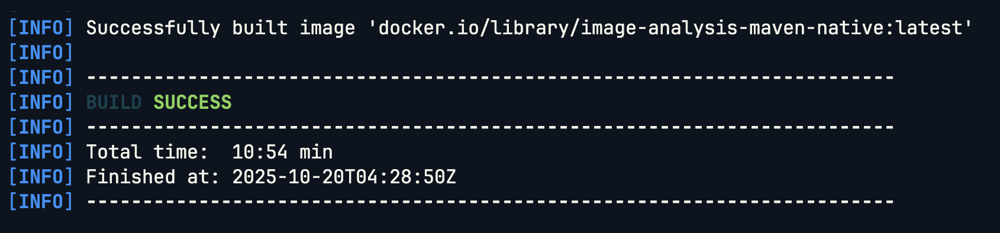

```bash
# 啟動應用程式
docker run --rm image-analysis-maven-native:latest 
```

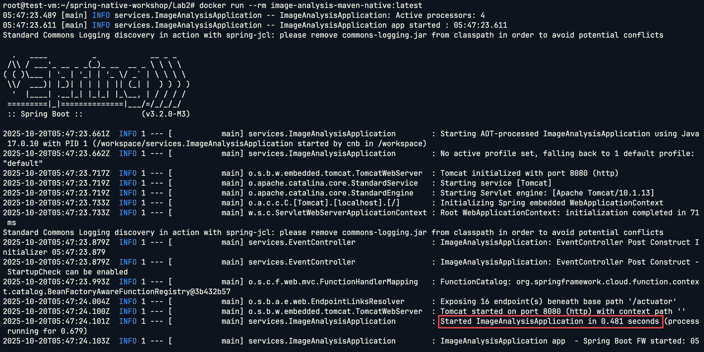

---

## 比較 JIT vs Native
Duration: 0:04:00

### 1. 比較映像檔大小

```bash
# 查看兩個版本的映像檔大小
docker images | grep image-analysis
```

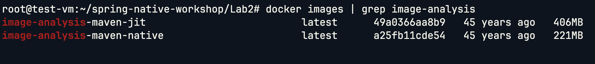

### 2. 比較啟動時間

**測試 JIT 版本**：
```bash
docker run --rm image-analysis-maven-jit
```
觀察啟動日誌中的時間。


**測試 Native 版本**：
```bash
docker run --rm image-analysis-maven-native
```
觀察啟動日誌中的時間。


### 3. 效能比較總結

| 指標 | JIT 版本 | Native 版本 | 改善幅度 |
|------|----------|-------------|----------|
| 映像檔大小 | ~400MB | ~200MB | **減少 50%** |
| 啟動時間 | ~5-10 秒 | ~0.05-1 秒 | **快 95%** |
| 建置時間 | ~1-3 分鐘 | ~10-20 分鐘 | - |

---

## 部署到 Cloud Run (JIT 版本)
Duration: 0:05:00

### 1. 設定 Docker 認證

```bash
# 設定環境變數
export PROJECT_ID=$(gcloud config get-value project)

# 設定 Docker 認證
gcloud auth configure-docker asia-east1-docker.pkg.dev
```

### 2. 標記並推送 JIT 映像檔

```bash
# 標記映像檔
docker tag image-analysis-maven-jit asia-east1-docker.pkg.dev/$PROJECT_ID/jit-image-docker-repo/jit-image:v1

# 推送到 Artifact Registry
docker push asia-east1-docker.pkg.dev/$PROJECT_ID/jit-image-docker-repo/jit-image:v1
```

### 3. 部署到 Cloud Run

```bash
gcloud run deploy my-jit-service \
  --image asia-east1-docker.pkg.dev/$PROJECT_ID/jit-image-docker-repo/jit-image:v1 \
  --region asia-east1 \
  --memory 2Gi \
  --allow-unauthenticated
```

部署完成後，進入 GCP Console 查看 [Cloud Run Console](https://console.cloud.google.com/run)  服務。

---

## 部署到 Cloud Run (Native 版本)
Duration: 0:25:00

### 1. 標記並推送 Native 映像檔

```bash
# 標記映像檔
docker tag image-analysis-maven-native asia-east1-docker.pkg.dev/$PROJECT_ID/native-image-docker-repo/native-image:v1

# 推送到 Artifact Registry
docker push asia-east1-docker.pkg.dev/$PROJECT_ID/native-image-docker-repo/native-image:v1
```

### 2. 部署到 Cloud Run

```bash
gcloud run deploy my-native-service \
  --image asia-east1-docker.pkg.dev/$PROJECT_ID/native-image-docker-repo/native-image:v1 \
  --region asia-east1 \
  --memory 2Gi \
  --allow-unauthenticated
```

部署完成後，進入 GCP Console 查看 [Cloud Run Console](https://console.cloud.google.com/run) 服務。

---

## 設定 Eventarc 觸發器
Duration: 0:05:00

Eventarc 可以讓 Cloud Storage 事件自動觸發 Cloud Run 服務。

### 1. 建立 JIT 服務的 Eventarc Trigger

```bash
gcloud eventarc triggers create image-analysis-jit-trigger \
     --destination-run-service=my-jit-service \
     --destination-run-region=asia-east1 \
     --location=asia-east1 \
     --event-filters="type=google.cloud.storage.object.v1.finalized" \
     --event-filters="bucket=uploaded-pictures-${PROJECT_ID}" \
     --service-account=${PROJECT_NUMBER}-compute@developer.gserviceaccount.com
```

### 2. 建立 Native 服務的 Eventarc Trigger

```bash
gcloud eventarc triggers create image-analysis-native-trigger \
     --destination-run-service=my-native-service \
     --destination-run-region=asia-east1 \
     --location=asia-east1 \
     --event-filters="type=google.cloud.storage.object.v1.finalized" \
     --event-filters="bucket=uploaded-pictures-${PROJECT_ID}" \
     --service-account=${PROJECT_NUMBER}-compute@developer.gserviceaccount.com
```

### 3. 驗證 Eventarc Trigger

```bash
# 列出所有 triggers
gcloud eventarc triggers list --location=asia-east1
```

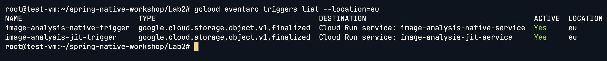

---

## 測試事件驅動流程
Duration: 0:03:00

### 1. 上傳圖片到 Cloud Storage

準備一張測試圖片，然後上傳到 Cloud Storage (可以使用 `gcloud CLI` 或從 `GCP Console` 上傳)：

```bash
# 上傳圖片
gsutil cp /path/to/your/image.jpg gs://${BUCKET_PICTURES}/

# 或使用 gcloud 指令
gcloud storage cp /path/to/your/image.jpg gs://${BUCKET_PICTURES}/
```

### 2. 查看 Cloud Run 日誌

**JIT Service Trigger:**

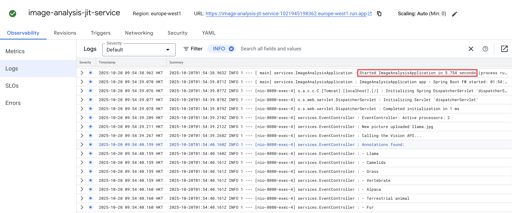

**Native Service Trigger:**

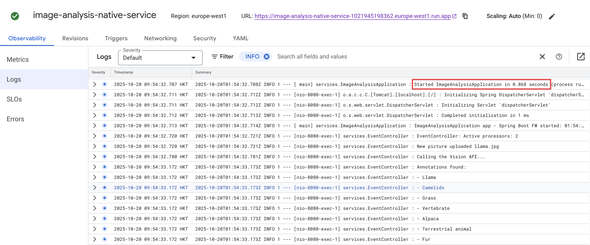

### 3. 驗證 Firestore 資料

1. 前往 [Firestore Console](https://console.cloud.google.com/firestore)
2. 查看 `pictures` collection
3. 確認有新的文件包含圖片分析結果

---

## 效能監控與比較
Duration: 0:02:00

### 查看 Cloud Run 指標

1. 前往 [Cloud Run Console](https://console.cloud.google.com/run)
2. 分別點選 `my-jit-service` 和 `my-native-service`
3. 查看「指標」標籤

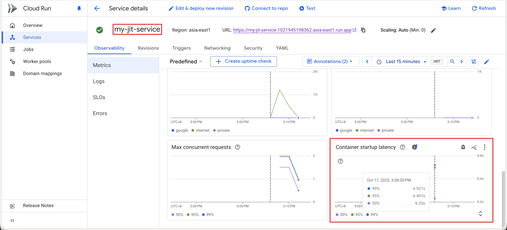
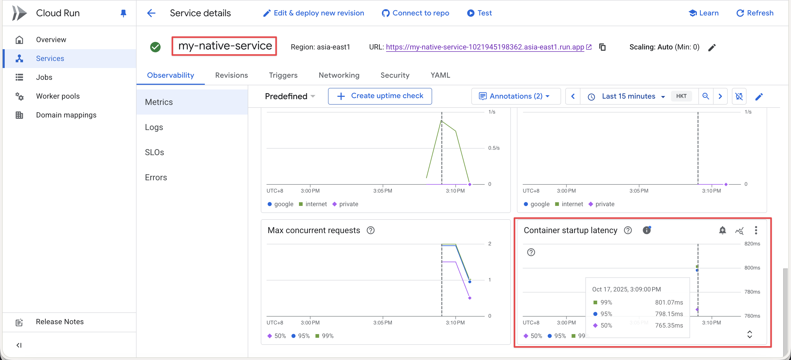

---

## 清理資源
Duration: 0:05:00

完成實驗後，記得清理資源以避免產生費用，也可以從 `GCP Console` 刪除！

### 1. 刪除 Eventarc Triggers

```bash
gcloud eventarc triggers delete image-analysis-jit-trigger --location=asia-east1 --quiet
gcloud eventarc triggers delete image-analysis-native-trigger --location=asia-east1 --quiet
```

### 2. 刪除 Cloud Run 服務

```bash
gcloud run services delete my-jit-service --region asia-east1 --quiet
gcloud run services delete my-native-service --region asia-east1 --quiet
```

### 3. 刪除 Artifact Registry Repositories

```bash
gcloud artifacts repositories delete jit-image-docker-repo --location=asia-east1 --quiet
gcloud artifacts repositories delete native-image-docker-repo --location=asia-east1 --quiet
```

### 4. 刪除 Cloud Storage Bucket

```bash
# 刪除 Bucket 及其內容
gsutil rm -r gs://${BUCKET_PICTURES}
```

### 5. 刪除 Firestore 資料庫

> **注意**：Firestore 資料庫需要透過 Console 手動刪除

1. 前往 [Firestore Console](https://console.cloud.google.com/firestore)
2. 點擊資料庫設定
3. 選擇「刪除資料庫」

### 6. 刪除 Compute Engine VM

完成 Workshop 後，記得刪除 VM 以避免持續產生費用。

**透過 Console 刪除**：

1. 前往 [Compute Engine > VM 執行個體](https://console.cloud.google.com/compute/instances)
2. 勾選您建立的 VM（例如：`spring-native-workshop-vm`）
3. 點擊上方的「刪除」按鈕
4. 確認刪除

**透過 gcloud 指令刪除**：

```bash
gcloud compute instances delete spring-native-workshop-vm \
  --zone=asia-east1-c \
  --quiet
```

> **提示**：刪除 VM 時，預設會一併刪除開機磁碟。如果您想保留磁碟以便日後使用，請在刪除時取消勾選「刪除開機磁碟」選項。

---

## 重要概念總結
Duration: 0:03:00

### JIT vs Native Image

| 特性 | JIT 編譯 | Native Image |
|------|----------|--------------|
| 編譯時機 | 執行時編譯 | 建置時編譯 |
| 啟動速度 | 較慢 (5-10秒) | 極快 (<0.1秒) |
| 記憶體使用 | 較高 | 較低 |
| 執行效能 | 長時間運行後最佳 | 立即最佳 |
| 建置時間 | 快 (1-5分鐘) | 慢 (10-20分鐘) |
| 映像檔大小 | 較大 (~400MB) | 較小 (~200MB) |
| 最佳使用場景 | 長期運行的服務 | Serverless/容器化應用 |

### 何時使用 Native Image？

✅ **適合使用**：
- Serverless 環境（Cloud Run, AWS Lambda）
- 需要快速啟動的應用
- 短期運行的任務
- 容器化微服務
- 資源受限環境

❌ **不建議使用**：
- 大量使用反射的應用
- 需要動態類別載入
- 開發階段（建置時間長）
- 需要 JVM 調優的場景

---

## 結論
Duration: 0:02:00

恭喜完成 Spring Native Workshop！

在本實驗中，您已經：

- ✅ 建置並比較了 JIT 和 Native 版本的 Spring Boot 應用程式
- ✅ 將應用程式部署到 Google Cloud Run
- ✅ 整合了多個 Google Cloud 服務（Storage, Firestore, Vision API）
- ✅ 設定了事件驅動架構（Eventarc）
- ✅ 了解了 Spring Native 的優勢和限制
- ✅ 掌握了效能監控和最佳化技巧

### 關鍵收穫

1. **Native Image 在 Serverless 環境中的優勢**
   - 95% 的啟動時間改善
   - 50% 的記憶體節省

2. **建置工具鏈**
   - Maven Wrapper 確保建置一致性
   - Cloud Native Buildpacks 簡化容器化
   - GraalVM 提供原生編譯能力

3. **雲端整合**
   - Eventarc 建立事件驅動架構
   - Cloud Run 提供無伺服器執行環境
   - 多個 GCP 服務無縫整合

---

**感謝參與本 Workshop！如有任何問題或建議，歡迎回饋。**

[← 返回首頁](https://seanchenr.github.io/spring-native-workshop/)
